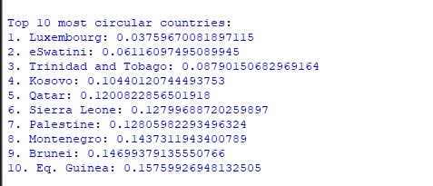
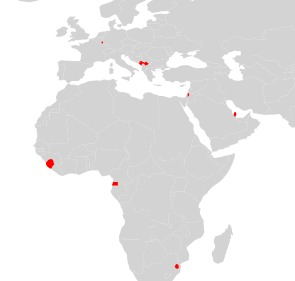

# most-circular-country

A project to determine which countries are most circular.

## Description

The "most-circular-country" project is an unfinished project that aims to determine the circularity of countries. It was created as a challenge from a friend and uses a simple logic to measure circularity.

## Installation

1. Download the project files.
2. Unzip the maps.
3. Change the `shp_path` variable in the code to point to your own path where the shapefile is located.

## Usage

Run the code, and the results will highlight which countries are most circular.

## Logic

The project uses a simple logic to measure circularity:
1. Around every country, create n amount of points (the higher the more accurate).
2. Get the distance of each point from the middle of the country.
3. Calculate the standard deviation of these distances. A perfect circle would have no standard deviation.

## Screenshots

## Contributing

This project is unfinished and currently not open to contributions.

## Credits

- **Challenge by:** Ahmed Samir

## License

This project is licensed under the MIT License - see the [LICENSE](LICENSE) file for details.
